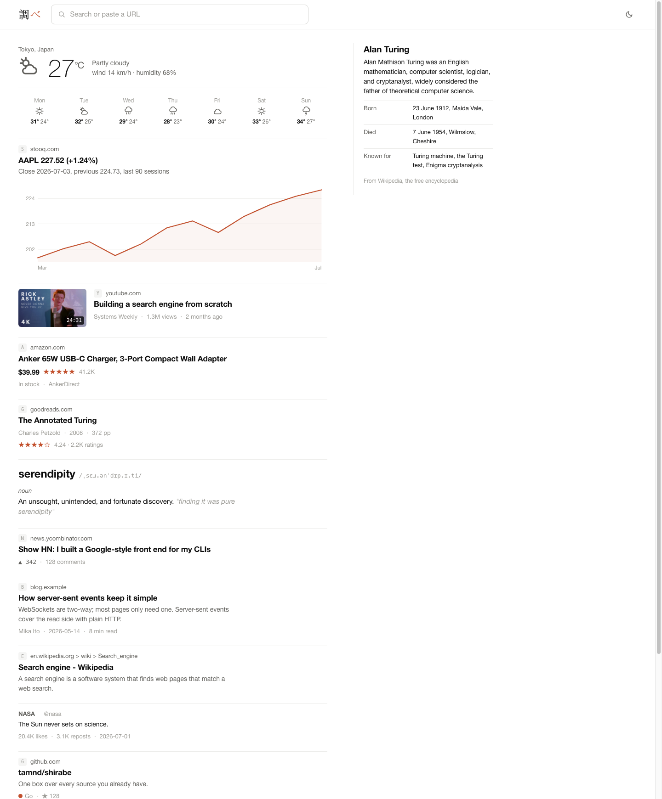
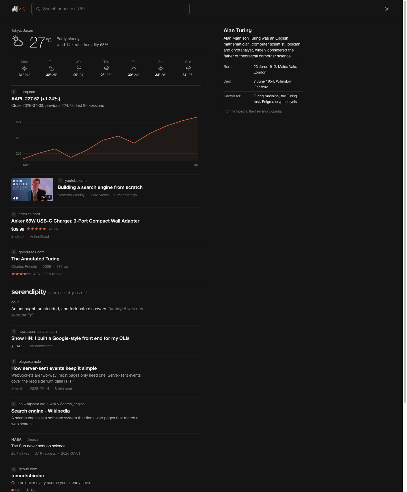

# 調べ shirabe

One search box over every source you already have.

shirabe is a small Go server with a Google-style front end.
Type a query or paste a URL and it fans out to its sources, streams back typed cards over SSE, and renders them as rich results: web hits, videos, products, books, weather, stock charts, definitions, knowledge panels.

Sources come in two flavors.
Native sources talk to open keyless APIs (Open-Meteo, Wikipedia, HN Algolia, dictionaryapi.dev, Stooq, oEmbed, OpenGraph).
Exec sources wrap any CLI that prints JSON, described by a small manifest file, no Go code required.
If you have `ytb` or `amz` on your PATH they light up automatically.





## Install

```sh
go install github.com/tamnd/shirabe/cmd/shirabe@latest
```

## Quickstart

```sh
shirabe serve --open          # web UI on http://localhost:8879
shirabe search "tokyo weather"
shirabe search "define serendipity"
shirabe search "stock AAPL"
shirabe search "!yt lofi beats"
shirabe resolve "https://www.youtube.com/watch?v=jNQXAC9IVRw"
shirabe sources               # what is registered and what is available
```

Queries are classified before fan-out.
A URL goes to the source that owns the host (longest suffix wins, with OpenGraph as the fallback for everything else).
An intent like weather, define, or stock goes to the matching answer source and gets boosted to the top.
A bang prefix (`!yt`, `!wiki`, `!hn`, `!amz`, `!gr`) forces a single source.
Anything else fans out to every searchable source concurrently.

## Cards

Every result is a card with a `kind` discriminator and a typed body:
`web`, `video`, `image`, `article`, `product`, `book`, `weather`, `chart`, `entity`, `definition`, `qa`, `post`, `repo`, `place`.
Unknown kinds downgrade to `web`, so older UIs never break on newer servers.

## Adding a source

Drop a JSON manifest into `~/.config/shirabe/sources.d/` and restart.
The manifest names a binary, argv templates, and a field map from the tool's JSON to card fields.
This is the built-in one for `ytb`, trimmed:

```json
{
  "name": "youtube",
  "binary": "ytb",
  "hosts": ["youtube.com", "youtu.be"],
  "search": {
    "args": ["search", "{query}", "-n", "{n}", "-o", "jsonl", "-q", "--type", "video"],
    "output": "jsonl",
    "kind": "video",
    "map": {
      "title": "title",
      "url": "url",
      "thumbnail": "thumbnail_url",
      "body.channel": "channel_name",
      "body.duration": "duration_text"
    }
  }
}
```

See [docs/adapters.md](docs/adapters.md) for the full manifest reference.
Built-in manifests exist for `ytb` (YouTube) and `amz` (Amazon); a user manifest with the same name overrides the built-in.

## HTTP API

| Route | What it does |
|---|---|
| `GET /api/query?q=` | SSE stream of `cards`, `error`, `done` events; `&stream=0` for buffered JSON |
| `GET /api/resolve?url=` | dereference one URL into cards |
| `GET /api/sources` | registered sources with capabilities and availability |
| `GET /api/suggest?q=` | typeahead suggestions |
| `GET /img?u=` | SSRF-hardened image proxy for card thumbnails |
| `GET /healthz` | liveness and version |

Details in [docs/api.md](docs/api.md).

## Development

```sh
go test ./...
shirabe serve --dev    # assets from ./web, plus /dev/cards with one fixture per card kind
```

The web UI is plain HTML, CSS, and ES modules embedded with `go:embed`.
There is no build step.

## License

MIT
